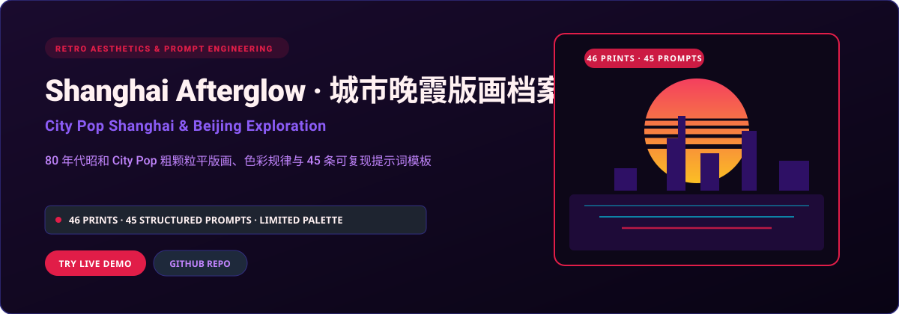
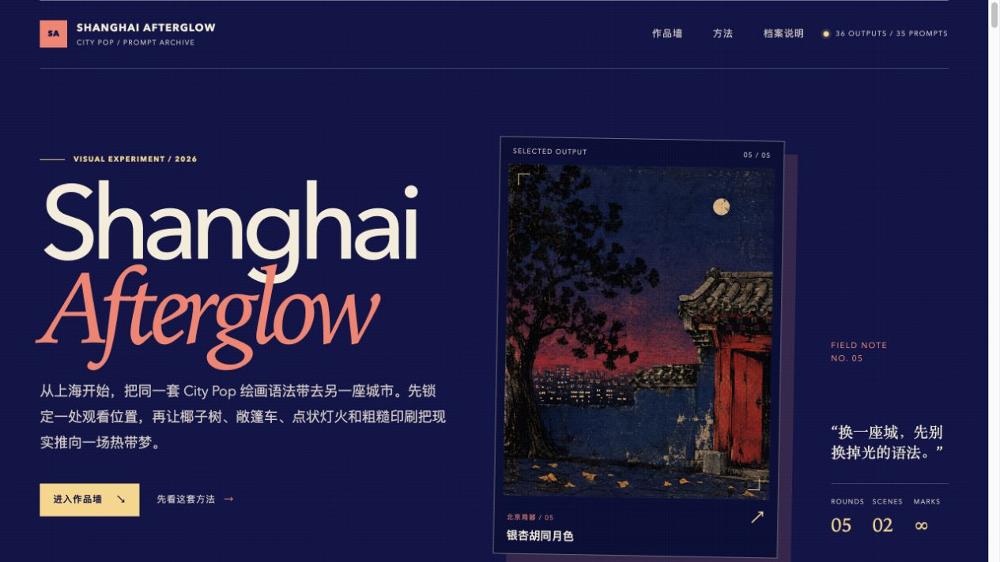

<p align="right">
  <strong>简体中文</strong> · <a href="./README.en.md">English</a>
</p>

<p align="center">
  
</p>

<p align="center">
  <a href="https://citypop-shanghai-exploration.xiaosang.cc/"><strong>🌐 在线体验 (Live Demo)</strong></a> · 
  <a href="https://holynova.github.io/citypop-shanghai-exploration/"><strong>🚀 备选镜像 (GitHub Pages)</strong></a> · 
  <a href="https://github.com/holynova/citypop-shanghai-exploration"><strong>📦 GitHub 源码</strong></a> · 
  <a href="https://xiaosang.cc/"><strong>✨ 更多作品集</strong></a>
</p>

---

## 真实预览 (Proof of Work)

<p align="center">
  
</p>

---

## 项目简介 (What It Is)

以上海与北京为母体的 80 年代经典 City Pop 绘画研究档案。收录 46 张高质量粗颗粒版画插画作品与 45 条严谨测试的结构化提示词。深入拆解永井博、铃木英人流派的核心视觉密码：热带棕榈与城市地标剪影、有限色渐变晚霞、粗颗粒网点及反光玻璃水面。

---

## 核心机制与特色 (Why It Matters)

- **有限色晚霞色板**：锁定 5 种核心昭和 City Pop 标志性色相：晚霞粉紫、暮光深靛、热带薄荷青、暖金与墨夜。
- **平版粗颗粒质感复现**：提示词深度调校颗粒度参数，模拟 80 年代日本胶印海报与黑胶唱片封套的物理纸感。
- **建筑地标符号融合**：把陆家嘴天际线、北京国贸、老洋房林荫道等现代城市机位自然融入昭和度假美学。
- **一键复制结构化 Prompt**：提供开箱即用的参数化提示词模板，包含机位、光源、调色盘与负向词库。

---

## 收录清单与规格 (Inventory & Scope)

46 幅全尺寸 City Pop 风格画作、45 条中英结构化提示词、色板配比分析、双模型画质实测对比。

---

## 快速开始 (Quick Start)

### 1. 在线体验
无需安装任何环境，直接在浏览器中打开：
- 🌐 **主站演示 (Primary)**：[https://citypop-shanghai-exploration.xiaosang.cc/](https://citypop-shanghai-exploration.xiaosang.cc/)
- 🚀 **备选镜像 (GitHub Pages)**：[https://holynova.github.io/citypop-shanghai-exploration/](https://holynova.github.io/citypop-shanghai-exploration/)

### 2. 本地运行与调试
克隆仓库后执行以下命令：

```bash
git clone https://github.com/holynova/citypop-shanghai-exploration.git
cd citypop-shanghai-exploration
npm run serve # or any static server
```

---

## 开源协议与作者 (License & Author)

- **作者**：[holynova (小桑)](https://xiaosang.cc/)
- **授权协议**：[MIT License](./LICENSE)
- **合辑收录**：本仓库作为精选项目收录于 [Where Craft Lives (xiaosang.cc)](https://xiaosang.cc/)。
